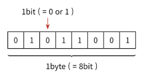

:::note 목차

**🔖 [ 데이터 타입의 종류 ](#기본형-원시형-primitive-type)**  
**🔖 [ 데이터 타입에 관한 배경지식 ](#데이터-타입에-관한-배경지식)**

<!-- **🔖 [ 변수 선언과 데이터 할당 ](#변수-선언과-데이터-할당)** -->
<!-- **🔖 [ 기본형 데이터와 참조형 데이터 ](#기본형의-데이터-타입)**   -->
<!-- **🔖 [ 불변 객체 ](#기본형의-데이터-타입)**   -->
<!-- **🔖 [ undefined와 null ](#기본형의-데이터-타입)**   -->
<!-- **🔖 [ 정리 ](#기본형의-데이터-타입)** -->

:::

---

    😃 책에서 기억하고 싶은 내용을 써보세요.

## 기본형 (원시형, primitive type)

### 기본형의 데이터 타입

:::info 기본형의 데이터 타입

- **숫자** (_`number`_)
- **문자열** (_`string`_)
- **불리언** (_`boolean`_)
- **`null`**
- **`undefined`**
- **symbol** (_ES6 에서 추가되었다._)

:::

## 참조형 (reference type)

### 참조형의 데이터 타입

:::info 참조형의 데이터 타입

- **객체** (_object_)
- **배열** (_array_)
- **함수** (_function_)
- **날짜** (_Date_)
- **정규표현식** (_Regexp_)

> ES6에서 추가된 **Map**, **WeakMap**, **Set**, **WeakSet**, 등이 객체의 하위 분류

:::

## 어떤 기준으로 기본형과 참조형을 구분할까?

### 기본형과 참조형의 차이점

:::info 기본형과 참조형의 차이점

_기본형은 할당이나 연산시 복제되고 참조형은 참조된다._

**다만 기본형은 값이 담긴 주솟값을 바로 복제하는 반면 참조형은 값이 담긴 주솟값들로 이루어진 묶음을 가리키는 주솟값을 복제한다는 점이 다르다.**

:::

 

## 데이터 타입에 관한 배경지식

### 메모리와 데이터

::::info 메모리와 데이터

- 컴퓨터는 모든 데이터를 0 또를 1로 바꿔 기억한다.
- 0 또는 1만 표현할 수 있는 하나의 메모리 조각을 **비트(bit)**라고 한다.
- 각 비트는 고유한 **식별자(unique identifier)**를 통해 위치를 확인한다.
- 모든 데이터는 **바이트(byte)**단위의 식별자, 더 정확하게는 메모리 주솟값을 통해 서로 구분하고 연결한다.

:::note 바이트(byte)

>   
> 매우 많은 비트를 한 단위로 묶으면 검색시간을 줄일 수 있고 표현할 수 있는 데이터 개수도 늘어나지만 낭비되는 비트가 생기기도 한다. 자주 사용하지 않을 데이터를 표현하기 위해 빈 공간을 남겨놓기 보다는 표현 가능한 개수에 문제가 되지 않을 적정한 공간을 묶는 편이 낫다.  
> _이러한 고민의 결과로 **바이트(byte)**라는 단위가 생겼다._

**1바이트는 8개의 비트로 구성**되어 있고 1비트마다 0 또는 1의 두가지 값으로 표현할수 있으므로  
**1바이트는 총 256(28)개의 값을 표현**하고 **2바이트는 16개의 비트이므로 65536(216)개의 값을 표현**할 수 있다.

:::

::::

### 식별자와 변수

::::info 식별자와 변수

- **변수**(variable)는 **'변할 수 있는 수'**이다. 영어 단어 **variable**은 원래 **'변할수 있다'**라는 형횽사 이지만 컴퓨터 용어로 쓸 때는 **'변할 수 있는 무언가'**라는 명사로 확장 시켰다.
- **식별자**(identifier)는 어떤 데이터를 식별하는데 사용하는 이름, 즉 **변수명**이다.

::::

---
